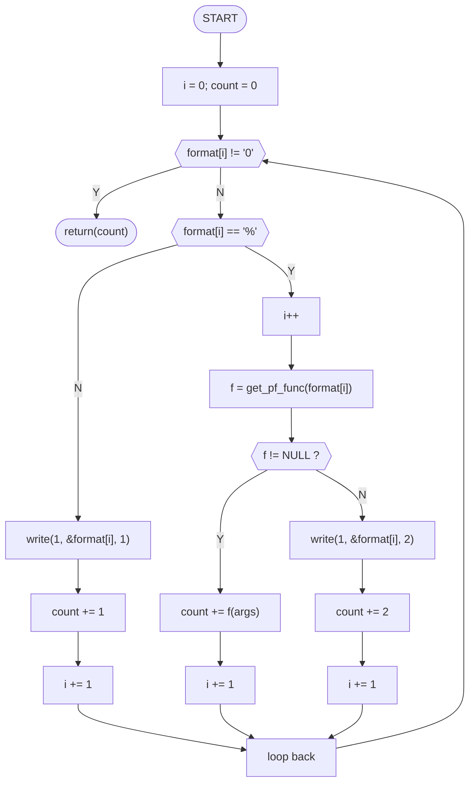

# _printf

## Table of contents

<details>
  <summary>
    CLICK TO ENLARGE
  </summary>
  📄 <a href="#description">Description</a>
  <br>
  🔀 <a href="#flow-chart">Flow Chart</a>
  <br>
  🔨 <a href="#tech-stack">Tech stack</a>
  <br>
  📂 <a href="#files-description">Files description</a>
  <br>
  💻 <a href="#installation">Installation</a>
  <br>
  🔧 <a href="#whats-next">What's next?</a>
  <br>
  👷 <a href="#authors">Authors</a>
  </details>

## <span id="description">Description</span>

`_printf()` writes all the characters provided between double quotation marks. Moreover, it allows additional arguments to be converted and written at any desired position in the string of characters. To indicate the position, a specific conversion modifier must be present.

The conversion modifiers supported by this function are:

* **%c**: Takes a variable of type `char` and prints a character.
* **%s**: Takes a variable of type `char*` and prints all characters.
* **%d**: Takes a variable of type `int` and prints it as characters.
* **%i**: Takes a variable of type `int` and prints it as characters.
* **%%**: Prints only the percent sign.

> **Note:** If the following character is not specified as a conversion modifier, the function will normally print the percent sign and the following character, unless it is the null byte (`'\0'`), in which case an error will be generated.

## <span id="flow-chart">Flow Chart</span>



## 🔨 <span id="tech-stack">Tech stack</span>

<p align="left">
  ©️Language Programming
</p>

<p align="left">
  🫂GitHub
</p>

<p align="left">
  🆚code
</p>

<p align="left">
  GCC compiler
</p>

## 📂 <span id="files-description">File description</span>

| **FILE**            | **DESCRIPTION**                                   |
| :-----------------: | ------------------------------------------------- |
| `_printf.c`         | File containing the main function                 |
| `get_pf_funct.c`    | Function calling the appropriate print function   |
| `pf_functions`      | contains the functions described below            |
| `print_char`        | Prints a character                                |
| `print_string`      | Prints a string of characters                     |
| `print_percent`     | Prints the % symbol                               |
| `print_int`         | Prints an integer                                 |
| `main.h`            | Local library containing the function prototypes  |
| `README.md`         | The README file (you are currently viewing it)    |
| `man_printf`        | Manual file                                       |
| `_printf.1`         | Manual file to install                            |


## <span id="installation">Installation</span>

1. Clone this repository:
  - Open your Terminal.
  - Navigate to the directory where you want to clone the repository.
  - Run the following command:

```bash
git clone https://github.com/22niko-spw/holbertonschool-printf.git
```

2. Open the repository you've just cloned.

3. In order to have access to the manual page copy the indicated file in the indicated adress with superuser powers:

```bash
sudo cp _printf.1 /usr/share/man/man1/
```
4. Compile the project:

```bash
gcc -Wall -Werror -Wextra -pedantic -std=gnu89 *.c -o _printf
```

## <span id="whats-next">What's next?</span>

- [ ] Add support for ```%u``` (unsigned int).

- [ ] Add support for ```%x``` & ```%X``` (hexadecimal).

- [ ] Add support for ```%p``` (pointers).

- [ ] Add support for ```%o``` (octal).

- [ ] Add support for ```%f``` (float).

- [ ] Handle field width ```%4f``` and precision ```%lu```

**Nicolas Ojeda**
- GitHub: [@Nicolas Ojeda](https://github.com/22niko-spw)
- LinkedIn: [@Nicola Ojeda](https://www.linkedin.com/in/nicolas-ojeda-259970211/)

**David Lengellé**
- GitHub: [@David Lengellé](https://github.com/DavidLengelle)
- LinkedIn: [@David Lengellé]( https://www.linkedin.com/in/david-lengellé-5973a3139/)